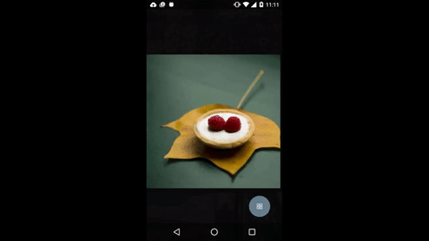

**FAB Animations Part 1:** 

In this blog post we are gonna demonstrate on how to achive the above animation.We will split the animation into arc motion animation and circular reveal animation, the arc motion animation is achived based on the concept of [bezire curve](https://en.wikipedia.org/wiki/B%C3%A9zier_curve).There is also a sample repo that demonstrates curved motion of [fab](https://github.com/saulmm/Curved-Fab-Reveal-Example), we will be using few classes from the repo and it's brief descriptions are as follows.

  >**PathPoint.java**:A class that holds information about a location and how the path should get to that location from the previous path location (if any). Any PathPoint holds the information for its location as well as the instructions on how to traverse the preceding interval from the previous location. 

  >**AnimatorPath.java**:Class that contains the list of pathpoint objects for a given curve,also specifies type motion either discontinous move to ,straight path or curve to motions of the fab to the given point.

  >**PathEvaluator.java**:This evaluator interpolates between two PathPoint values given the value t, the proportion traveled between those points. The value of the interpolation depends on the operation specified by the endValue (the operation for the interval between PathPoints is always specified by the end point of that interval).basically responsible for calculating the cureved bezire path points.

The android co-ordinate system is such that 0,0 is on the top left corner. (0,MaxY) is bottom left and (maxx,maxy) bottom right and right top is (Maxx,0),therfore points for the exponential curve are as follows (-200, -50, -230, -450, -255, -500).

>//code that animates curved motion. 
 	AnimatorPath path = new AnimatorPath(); 
 	path.moveTo(0, 0); 
 	path.curveTo(-200, -50, -230, -450, -255, -500); 
 	final ObjectAnimator anim = ObjectAnimator.ofObject(this, "fabLoc",
 	new PathEvaluator(), path.getPoints().toArray()); 
 	anim.setInterpolator(new AccelerateDecelerateInterpolator()); 
 	anim.setDuration(300); 
 	anim.start(); 

Now as the animator produces the new path points we need setter method that set's fab location. so define this method in your fragment.This setter will be called by the ObjectAnimator given the 'fabLoc' property string.
>public void setFabLoc(PathPoint newLoc) { 
  	mFab.setTranslationX(newLoc.mX); 
    //flag describing whether layout is revealed or not 
    if (mRevealFlag) 
        mFab.setTranslationY(newLoc.mY - (mFabSize / 2)); 
    else 
        mFab.setTranslationY(newLoc.mY); 
 }

Now the second part reveal animations you have to wait until the curved animation to end and then  call reveal animation,for that purpose we can add listner which gives animation end callback.

>on end method of animation listner  create circular reveal animations
ViewAnimationUtils.createCircularReveal(revealLayout,cx,cy,0,finalRadius);

Now here the tricky part would be to reverse animate along the path (same points in the reverse order doesnt work, also i was lazy to calculate the points like how we did it to move upwards) instead extend interpolator and override the method as follows.

>@Override 
 public float getInterpolation(float paramFloat) { 
    return Math.abs(paramFloat -1f); 
 }

Find out more in detail by [visiting the project on GitHub](https://github.com/callmekarthik/AnimationsDemo).

Also do check this old but awesome blog post about curve motion by [Chet Haase](http://graphics-geek.blogspot.com.es/2012/01/curved-motion-in-android.html).

**Note**:this kind of fab animation will be useful when you want to animate the fab in the fragment or maybe inside one single activity without transitions,in case of the activity transition animation please follow my next blog post where we can achive it using transitions by moving from one activity to another.
